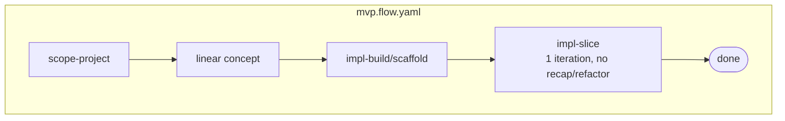
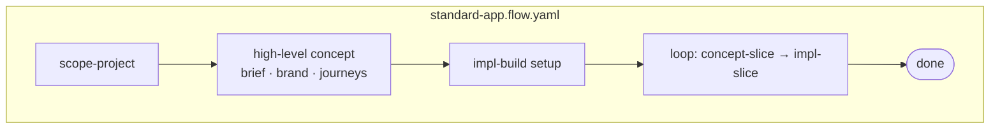

A **flow** is a YAML graph of skill nodes and edges — a runnable path through the
skill tree. Each flow is **self-contained**: it carries a top-level `requires:`
block — its **installation manifest** — naming the contracts its skills read plus
every skill its nodes run. There are no separate bundle files; the flow *is* the
manifest. Flows live under `skaileup/flows/<tier>/`:

```
skaileup/flows/
├── concept-slice/
│   ├── concept-slice.flow.yaml   ← graph + requires: manifest
│   └── concept-slice.md
├── impl-slice/
│   ├── impl-slice.flow.yaml
│   └── impl-slice.md
├── mvp/
│   ├── mvp.flow.yaml
│   └── mvp.md
├── simple-app/
│   ├── simple-app.flow.yaml
│   └── simple-app.md
├── standard-app/
│   ├── standard-app.flow.yaml
│   └── standard-app.md
└── complex-app/
    ├── complex-app.flow.yaml
    └── complex-app.md
```

## Install — a flow installs its own deps

Installing a flow provisions everything in its `requires:` via the **skaile
workspace CLI**. Install the whole collection, or just one flow's dependencies:

```bash
$ skaile add skill:*                    # install every skill
$ skaile add flow:simple-app            # OR install exactly what simple-app needs
```

The `requires:` block lists scoped asset refs (`kind:@publisher/name`) — only
`contract:` and `skill:` kinds. It is **exact**: exactly the skills the flow's
nodes run, **no inheritance and no extras**.

```yaml
# inside mvp.flow.yaml, above globals:
requires:
  - contract:@skaile-ai/shared-contracts
  - skill:@skaile-ai/concept-brief
  - skill:@skaile-ai/product-spec-features
  # …every skill mvp's nodes run, and nothing else
```

## Run — engine or orchestrator

Once installed, a flow can be run **two interchangeable ways**:

```bash
$ skaile run flow:simple-app            # 1. the skaile workspace flow engine (connector)
```

```text
2. the orchestrator (skaileup / skaileup-build) reads the same .flow.yaml and
   guides/executes it conversationally — used when there's no flow engine, or
   when you want a human-in-the-loop run.
```

Both follow the identical node graph; pick the engine for hands-off execution,
the orchestrator for a guided run. Either way, the flow's skills + contracts must
already be installed (whole collection, or `skaile add flow:<name>`).

The two slice flows (`concept-slice`, `impl-slice`) are **building blocks**.
Tier flows compose them.

## Tier composition







Larger tiers are supersets of smaller ones by construction (`mvp ⊂ simple-app ⊂
standard-app ⊂ complex-app`), but each flow lists its **own complete** `requires:`
manifest rather than inheriting — so what installs is always exactly what runs.

## Drift guard

`skaileup/flows/_meta/verify_flows.py` validates every flow against
`flow.schema.json` and enforces that each flow's `requires:` skill set **exactly**
matches the skills its nodes run (nothing missing, nothing extra) and that its
`contract:` refs resolve in `skaile.yaml`. Run it on every flow change;
`test_verify.py` covers it.

## Custom flows

You can create your own flow by starting from a tier and overriding what you need. Create a file such as `skaileup/flows/custom/custom.flow.yaml`:

```yaml
extends: standard-app
requires:
  - contract:@skaile-ai/shared-contracts
  - skill:@skaile-ai/ops-sync
  # …list every skill your nodes run
nodes:
  - id: my-extra-step
    type: skill
    data:
      skill: ops-sync
      after: [impl-slice]
```
