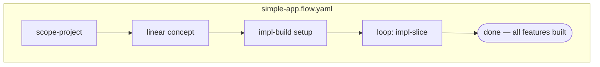
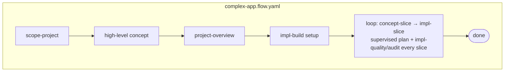

A **flow** is a YAML graph of skill nodes and edges. A **bundle** is the matching list of skills that flow needs installed. They come in pairs, co-located under `skaileup/flows/<tier>/`:

```
skaileup/flows/
├── concept-slice/
│   ├── concept-slice.flow.yaml
│   └── concept-slice.bundle.yaml
├── impl-slice/
│   ├── impl-slice.flow.yaml
│   └── impl-slice.bundle.yaml
├── mvp/
│   ├── mvp.flow.yaml
│   └── mvp.bundle.yaml
├── simple-app/
│   ├── simple-app.flow.yaml
│   └── simple-app.bundle.yaml
├── standard-app/
│   ├── standard-app.flow.yaml
│   └── standard-app.bundle.yaml
└── complex-app/
    ├── complex-app.flow.yaml
    └── complex-app.bundle.yaml
```

Use:

```bash
$ skaile add bundle:simple-app          # install the skills the flow needs
$ skaile run flow:simple-app            # execute the flow
```

The two slice flows (`concept-slice`, `impl-slice`) are **building blocks**.
Tier flows compose them.

## Tier composition







Bundles inherit: `simple-app` includes `mvp`, `standard-app` includes
`simple-app`, `complex-app` includes `standard-app`. Each bundle file lists
only its *additions*.

## Bundle-from-flow generation

`lab/compile-bundle` walks a flow's node graph and emits the matching
`<name>.bundle.yaml`. **Run on every flow change** to prevent drift between
what the flow executes and what the bundle installs. The repo also ships a
`scripts/check-bundles.sh` that enforces this in CI.

## Custom flows

You can create your own flow by starting from a tier and overriding what you need. Create a file such as `skaileup/flows/custom/custom.flow.yaml`:

```yaml
extends: standard-app
nodes:
  - id: my-extra-step
    type: skill
    data:
      skill: ops/sync
      after: [impl-slice]
```
