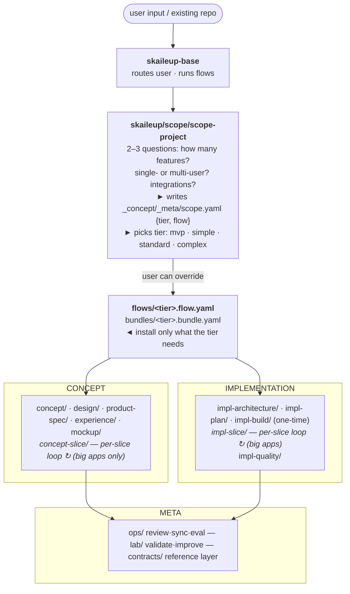
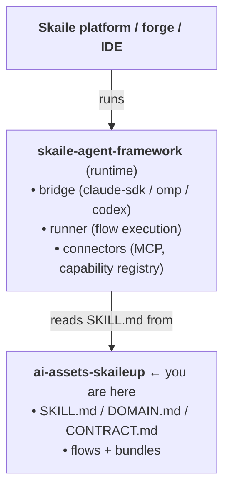

The collection is shaped by one observation: **the work of *figuring out* a
product and the work of *building* it have the same rhythm.** Each side
benefits from a per-feature loop when the product is too big to design or
build in one pass. So we get the same shape on both halves — concept-slice on
one side, impl-slice on the other.

## The three groups

| Group | Purpose | Domains |
|---|---|---|
| **Concept** | What the product *is* | concept · design · product-spec · experience · concept-slice · mockup-component · mockup-walkthrough · mockup-feedback |
| **Implementation** | What the product *becomes* | impl-architecture · impl-plan · impl-slice · impl-build · impl-quality |
| **Meta** | Cross-cutting, runs against the others | skaileup · ops · lab · contracts |

## The two slice loops

Both `concept-slice/` and `impl-slice/` follow the same shape — each phase
hands off to the next via a scratch file:

| concept-slice | impl-slice | what the phase does |
|---|---|---|
| brainstorm¹ | brainstorm | surface the unknown |
| align | align | grill-me interview |
| scope-feature | plan-vertical | decompose, define test strategy |
| design-feature | implement → test | build it |
|  | recap → refactor → commit | lock it in |

¹ concept-slice brainstorm runs only in `complex-app`; `standard-app` starts at align.

After every phase the user runs `/clear` (or starts a new chat) and the next
phase reads the prior phase's handoff from `_concept/slices/<id>/` or
`_implementation/slices/<id>/`. **No phase carries the whole slice in context** — that's
how big apps stay buildable past the dumb-zone (~100k tokens).

The slice dossier is **frozen on commit, not deleted**: the terminator writes an
`index.md` and keeps the phase handoffs as permanent per-feature documentation.
Truth lives in code (`impl-slice`) or in the canonical `_concept/experience/...`
artifacts (`concept-slice`); the dossier is the decision record beside them. A
dossier with an `index.md` is frozen; one without is still in flight.

## The meta layer

- **`skaileup/`** — base orchestrators (`skaileup`, `skaileup-build`) plus
  `scope/` (the tier picker). The pipeline entry point.
- **`ops/`** — operates on artifacts: `review`, `sync`, `eval-{concept,feature,product}`,
  `add-feature`, `reverse-engineer`, `project-{overview,review,subsystem-map,integration}`.
- **`lab/`** — operates on **skills themselves**: `validate`, `judge`, `improve`,
  `learn`, `report`, `compile-validators`, `compile-bundle`, `archive`.
- **`contracts/`** — shared reference layer. **Every skill reads from here.**
  Iron laws, golden principles, semantic types, frontmatter schemas, the DSL
  grammar itself.

## Where it sits in the Skaile stack

