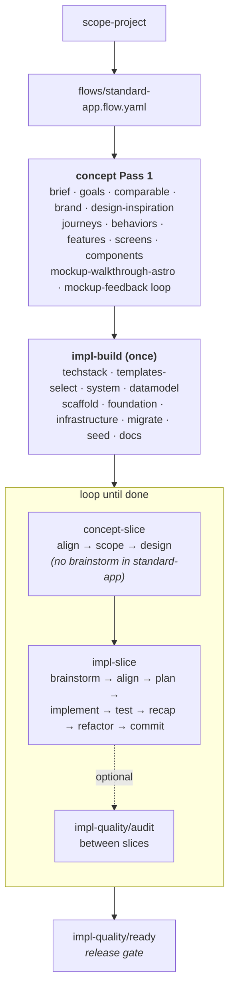

This page walks the collection end-to-end for a `standard-app`. (The other tiers
are slimmer specializations of the same pipeline — see [Tiers](/intro/tiers/).)

## 0. Scope

```
$ skaile run flow:standard-app
```

`skaileup/` is the entry orchestrator. Its first move is `skaileup/scope/scope-project`,
which interviews the user (2–3 questions) and writes `_concept/_meta/scope.yaml`:

```yaml
tier: standard-app
flow: standard-app.flow.yaml
signals:
  features: ~12
  multi_user: true
  persistence: db
  integrations: [stripe]
```

The flow + bundle for the chosen tier are loaded. Only the skills the tier
needs are installed.

## 1. Concept — high-level pass

For `standard-app` and `complex-app`, the concept side runs in two passes.
**Pass 1** establishes the grand scheme (one linear pass through discovery,
design, experience, and mockups):

```
brief + goals + comparable
  → brand-visual + design-inspiration
  → journeys + behaviors + features + screens + components
  → mockup-walkthrough-astro / static-html + mockup-component-storybook
  → mockup-feedback loop (annotate → triage → patch → apply)
```

| Skill | Output |
|---|---|
| `concept/brief` | `_concept/discovery/brief.md` — elevator pitch, audience, problem, hero flow |
| `concept/goals` | `_concept/discovery/goals.md` |
| `concept/comparable` | `_concept/discovery/comparable.md` |
| `design/brand-visual` | `_concept/design/identity.md`, `tokens.json` |
| `design/inspiration` | `_concept/design/inspiration.md` — visual references and mood |
| `experience/journeys` | `_concept/experience/journeys/stories.json` (EARS criteria, candidate features) |
| `experience/behaviors` | `_concept/experience/behaviors.md` — cross-screen interaction rules |
| `product-spec/features` | `_concept/experience/features/<group>/<feature>.md` (high-level) |
| `experience/screens` | `_concept/experience/screens/<feature>/` — high-level screen specs |
| `experience/components` | `_concept/experience/components/` — shared component inventory |
| `mockup-walkthrough-astro` | `_concept/mockup-walkthrough/astro/` — clickable Astro mockup |
| `mockup-feedback-*` | Annotation → triage → patch → apply loop on the walkthrough |

After Pass 1 the agent has a feature list, brand, high-level screen specs, and a
walkthrough mockup. It does **not** yet have per-feature detailed design,
per-feature acceptance criteria, or implementation-ready vertical decomposition.
That is what concept-slice delivers.

## 2. Concept — slice loop (per feature)

For each feature in the high-level list, run `concept-slice/`:

```
brainstorm → align → scope-feature → design-feature
```

`design-feature` writes back into the permanent `_concept/` artifacts:
`product-spec/features/<feature>.md` (full), `experience/screens/<feature>/`,
the mockup variant for the tier, and adds the feature's entities to the
datamodel. Then the loop hands off.

## 3. Implementation — project setup (once)

```
impl-architecture/techstack → impl-architecture/templates-select →
impl-architecture/system → impl-architecture/datamodel →
impl-build/scaffold → impl-build/foundation → impl-build/infrastructure →
impl-build/migrate → impl-build/seed → impl-build/docs
```

| Skill | What |
|---|---|
| `impl-architecture/techstack` | Selects the stack family (Next.js, SvelteKit, Django, …) |
| `impl-architecture/templates-select` | Resolves the matching `template-*` reference asset; writes `tech_stack_skill` |
| `impl-architecture/system` | High-level system design (apps, services, protocols) |
| `impl-architecture/datamodel` | Generates the canonical `model.json`, `seed.json`, `feature_map.json` |
| `impl-build/scaffold` | Runs the template's scaffold command |
| `impl-build/foundation` | Auth, layout shell, design-tokens-as-code |
| `impl-build/infrastructure` | CI, hosting config, env vars, secrets management |
| `impl-build/migrate` | Initial migration from the datamodel |
| `impl-build/seed` | Seed data scenarios from `seed.json` |
| `impl-build/docs` | Generates the initial project README and API docs |

These are **one-time** skills. They never run again unless the stack changes.

## 4. Implementation — slice loop (per feature, runs N times)

For each feature, run `impl-slice/`:

```
impl-plan/brainstorm → impl-plan/align → impl-plan/plan-vertical →
impl-slice/implement → impl-slice/test →
impl-slice/recap → impl-slice/refactor → impl-slice/commit
```

Between every phase the user runs `/clear`. Phases read from
`_implementation/slices/<id>/`. After landing atomic commits, `commit` **freezes**
the dossier — writes an `index.md` and keeps the phase handoffs as per-feature
documentation (only the transient `progress.json` is removed).

## 5. Quality gates (between slices, or at release)

For `standard-app`:

```
impl-quality/test-unit · test-integration · test-e2e · ready
ops/review · ops/sync
```

`complex-app` adds:

```
impl-quality/eval-code · audit          ← between each impl-slice
```

`ready` is the release gate. `audit` and `eval-code` run between slices in
complex-app to catch drift before it compounds.

## End-to-end


