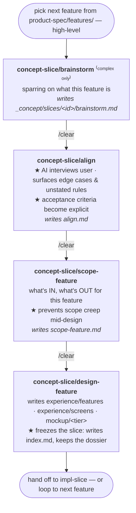
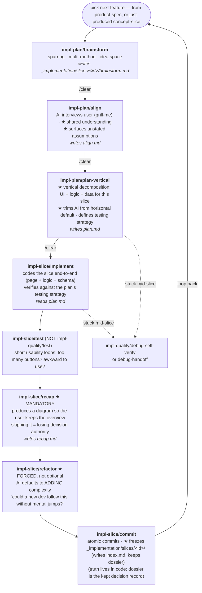

import { Aside } from '@astrojs/starlight/components';

Both halves of the collection have a per-feature loop with the same shape. The
shape is what makes context resets safe: each phase reads a scratch file from
the prior phase, not chat history.

## concept-slice (per feature, big apps)

<Aside type="note">
`standard-app` runs the shorter three-phase loop: **align → scope-feature → design-feature** (no brainstorm). `complex-app` prepends **brainstorm** as the first phase. Both use `/clear` between phases and read from the `_concept/slices/<id>/` dossier (frozen, kept, on commit).
</Aside>

## impl-slice (per feature, runs N times)

## Why the resets work

Every slice phase **reads from the prior phase's handoff file** rather than
from chat history. After each phase the user runs `/clear` (or starts a new
chat) — the next phase loads the handoff file and continues. The dumb zone
(~100k tokens for most agents) is avoided because no single phase carries the
whole slice in context.

## Why the slice dossier is frozen (not deleted) on commit

After a slice ships, truth lives in **code** (impl-slice) or in the canonical
**`_concept/experience/...` artifacts** (concept-slice). The slice folder is
**frozen, not deleted**: the terminator writes an `index.md` and keeps the phase
handoffs (`brainstorm · align · scope-feature` / `… · plan · test · recap ·
refactor`) as permanent per-feature documentation under `_concept/slices/<id>/`
and `_implementation/slices/<id>/`. The dossier is the decision record beside the
shipped artifact; a folder with an `index.md` is frozen, one without is still in
flight. (Only the impl side's transient `progress.json` is removed.)

## Mandatory phases

| Phase | Why it can't be skipped |
|---|---|
| `recap` | After 5+ iterations the user loses the overview. Recap forces a re-explainable diagram and keeps decision authority with the human. |
| `refactor` | The agent's natural default is to **add** complexity. Refactor as a separate phase forces "could a new dev follow this without mental jumps?" |
| `align` | The interviewer surfaces what wasn't said. Without it, the implement phase finds the gap halfway through, after a /clear, with no recourse. |
