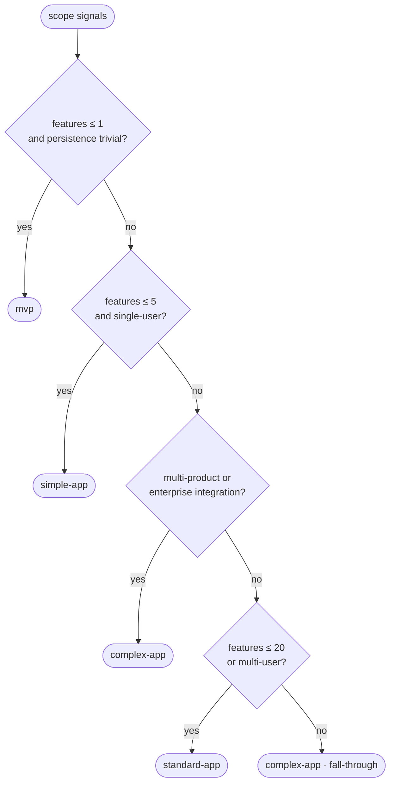
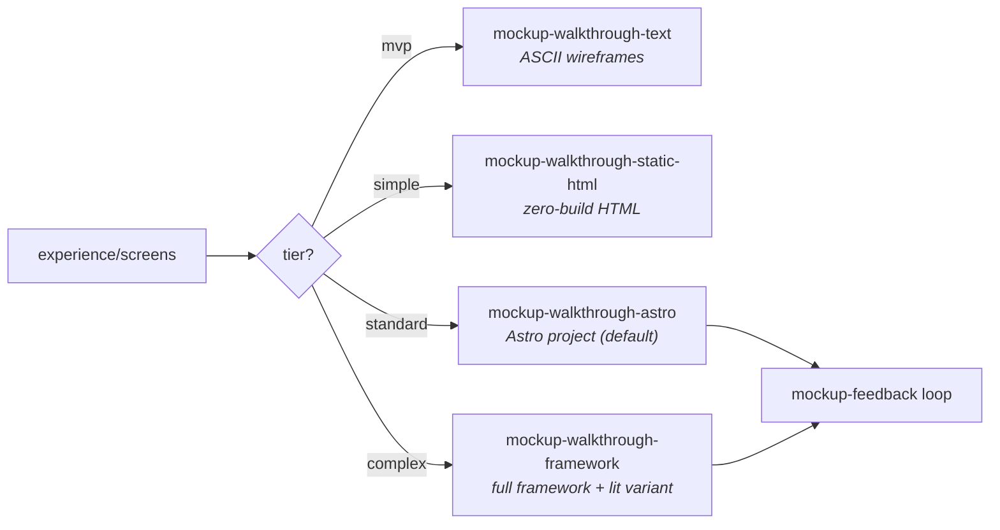
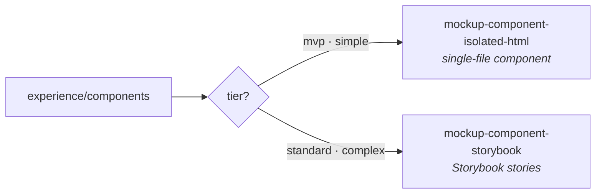
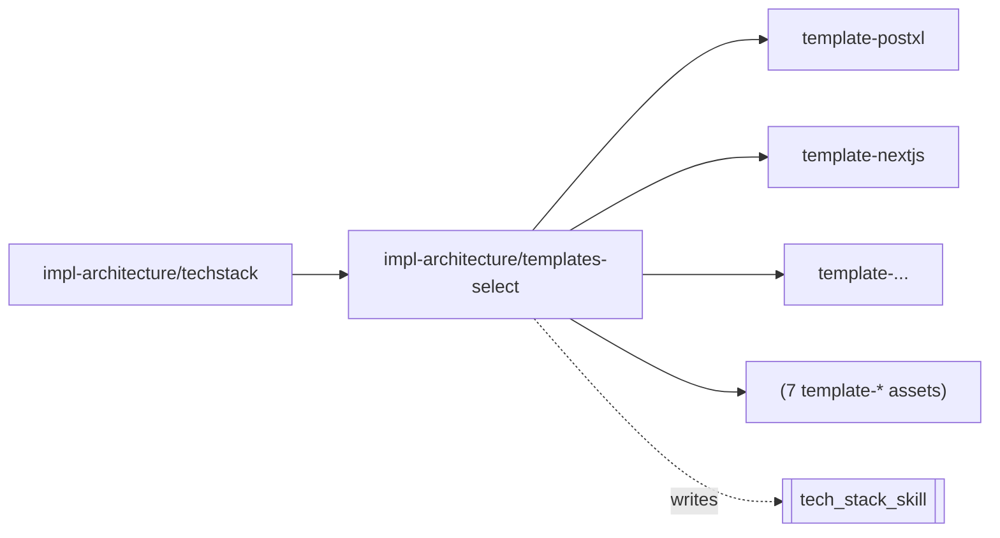

The first thing the agent does is **pick a tier**. The rest of the pipeline is
shaped by that choice: which skills install, whether concept slicing happens,
whether the impl loop runs once or N times, and how much human supervision is
required.

## The four tiers

```
              concept side             implementation side       supervision
              ─────────────            ─────────────────────     ──────────
mvp           linear, minimal          single impl-slice         autonomous
              (no design slicing)      (skip recap, refactor)

simple-app    linear, full             N × impl-slice            autonomous
              (one pass through all    (full slice loop)
              features upfront)

standard-app  linear high-level +      N × impl-slice            mostly autonomous,
              N × concept-slice        (full slice loop +        plan checkpoint
              (no brainstorm;           recap mandatory)         per slice
               align+scope+design)

complex-app   linear high-level +      N × impl-slice            HITL — supervised
              N × concept-slice        (full slice loop +        plan + brainstorm
              (full; incl. brainstorm) audit between slices)     + align per slice
              + project-overview
```

## Decision rule

The `skaileup/scope/scope-project` skill picks a tier from a 2–3 question
interview. The branches are evaluated top-down:



`multi-product or enterprise integration` is satisfied when
`signals.persistence == "external"` OR `len(signals.integrations) >= 2` — this
check sits **above** the multi-user branch so a multi-user enterprise app
doesn't short-circuit to `standard-app`.

The user can override at any time with `scope-project --tier=<name>`.

## Skill composition by tier

```
                            mvp  simple  standard  complex
                            ────────────────────────────────
   skaileup/scope/scope     ✓    ✓       ✓         ✓
   ─────────────────────────────────────────────────────
   concept/brief            ✓    ✓       ✓         ✓
   concept/goals                         ✓         ✓
   concept/comparable                    ✓         ✓
   design/brand-visual           ✓       ✓         ✓
   design/inspiration                    ✓         ✓
   design/brand-voice                              ✓
   product-spec/features    ✓    ✓       ✓         ✓
   experience/journeys           ✓       ✓         ✓
   experience/screens            ✓       ✓         ✓
   experience/behaviors                  ✓         ✓
   experience/components                 ✓         ✓
   mockup-walkthrough-text  ✓
   mockup-walkthrough-static-html ✓
   mockup-walkthrough-astro              ✓         ✓
   mockup-walkthrough-framework                    ✓
   mockup-component-isolated-html ✓
   mockup-component-storybook            ✓         ✓
   mockup-feedback-*                     ✓         ✓
   ─────────────────────────────────────────────────────
   concept-slice/*                       ✓         ✓
   ─────────────────────────────────────────────────────
   impl-architecture/techstack ✓ ✓       ✓         ✓
   impl-architecture/datamodel    ✓      ✓         ✓
   impl-architecture/system              ✓         ✓
   impl-plan/brainstorm                  ✓         ✓
   impl-plan/align                ✓      ✓         ✓
   impl-plan/plan-vertical  ✓    ✓       ✓         ✓
   impl-plan/supervised                            ✓
   impl-build/scaffold      ✓    ✓       ✓         ✓
   impl-build/foundation         ✓       ✓         ✓
   impl-build/migrate            ✓       ✓         ✓
   impl-build/seed               ✓       ✓         ✓
   impl-build/infrastructure             ✓         ✓
   impl-build/docs               ✓       ✓         ✓
   impl-slice/implement     ✓    ✓       ✓         ✓
   impl-slice/test               ✓       ✓         ✓
   impl-slice/recap              ✓       ✓         ✓
   impl-slice/refactor                   ✓         ✓
   impl-slice/commit        ✓    ✓       ✓         ✓
   ─────────────────────────────────────────────────────
   impl-quality/test-unit   ✓    ✓       ✓         ✓
   impl-quality/test-e2e         ✓       ✓         ✓
   impl-quality/test-integration         ✓         ✓
   impl-quality/eval-code                          ✓
   impl-quality/audit                              ✓
   impl-quality/ready                    ✓         ✓
   ─────────────────────────────────────────────────────
   ops/review                            ✓         ✓
   ops/sync                              ✓         ✓
   ops/project-*                                   ✓
```

Bundles inherit: `simple-app` includes `mvp`, `standard-app` includes `simple-app`,
`complex-app` includes `standard-app`. Each bundle file lists only its
*additions*.

**concept-slice phases by tier:** `standard-app` runs `align → scope-feature → design-feature` (no brainstorm). `complex-app` adds `brainstorm` as the first phase. Both still require `/clear` between phases and read from `_slice/concept/<id>/` scratch files.

## Skill alternatives

Several skills are **mutually exclusive variants** — the tier (or a selector
skill) picks exactly one. They produce the same kind of artifact at different
fidelity, so installing more than one is redundant.

### Walkthrough mockups — fidelity rises with tier



### Component mockups — two render targets



### Tech-stack template — one of seven, chosen at runtime



`templates-select` is the **selector**: it reads the chosen stack and resolves
exactly one `template-*` reference asset, writing `tech_stack_skill` for the
build phase to consume. The templates are reference assets, not skills.

## Why slicing matters

A 20-feature app designed all at once **discovers halfway through that
feature 3 changes feature 1's screens**. Big apps slice both sides:

1. Pick the next feature from the high-level product-spec.
2. Run `concept-slice` on it (brainstorm → align → scope → design).
3. Hand off to `impl-slice` (brainstorm → align → plan → implement → test → recap → refactor → commit).
4. Loop back. *The next concept slice has learned from the just-shipped
   implementation.*

That feedback only works if the loops actually reset between phases. See
[Slice Loops](/intro/slice-loops/) and [Workspace Zones](/intro/workspace-zones/).
